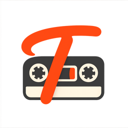

<p align="center">
  
</p>

<h1 align="center">Tapedeck</h1>

<p align="center">
  Turn Plaud recordings into searchable, project-organized transcripts.
</p>
<p align="center">
  A native macOS app that syncs in the background, transcribes with Deepgram,
  classifies with Gemini, and writes stable files into <code>~/Tapedeck/</code>
  for Obsidian, Hazel, Spotlight, and shell scripts.
</p>

<p align="center">
  <a href="https://github.com/tavva/tapedeck/actions/workflows/test.yml"></a>
  
  
  
</p>

It is designed to be quiet: the helper keeps syncing while the app is closed,
the UI stays focused on review and correction, and the filesystem layout is
stable enough for automation.

## What It Does

- **Syncs Plaud recordings** through a signed-in Plaud web session.
- **Downloads audio and source metadata** into dated folders under
  `~/Tapedeck/audio/`.
- **Transcribes recordings with Deepgram**, including speaker-labelled plain
  text and raw Deepgram JSON.
- **Classifies transcripts with Gemini** into user-defined projects, with a
  configurable confidence threshold.
- **Maintains project folders** under `~/Tapedeck/projects/<slug>/`, using
  transcript/JSON copies plus symlinks back to the original audio.
- **Runs in the background** through a LaunchAgent-backed sync helper every
  15 minutes.
- **Lets you review manually**: play audio, transcribe, classify, override
  project assignment, and rename speaker labels from the native UI.

## Requirements

Tapedeck is currently a macOS app built from source or distributed as a signed
DMG.

For the app:

- macOS 14 or later.
- A Plaud account with access to recordings at <https://web.plaud.ai/>.
- A Deepgram API key for transcription.
- A Google AI Studio / Gemini API key for classification.

For development:

- Xcode with Swift 6 support.
- [XcodeGen](https://github.com/yonaskolb/XcodeGen), used to generate
  `Tapedeck.xcodeproj` from `project.yml`.
- A Developer ID certificate, `TEAM_ID`, notarization credentials, and Sparkle
  tools only if you are building release DMGs.

## Quick Start

### Install a Release Build

1. Download the latest `Tapedeck.dmg` from
   <https://github.com/tavva/tapedeck/releases/latest>.
2. Drag `Tapedeck.app` into `/Applications`.
3. Open Tapedeck and follow the first-launch flow:
   [docs/runbooks/first-launch.md](docs/runbooks/first-launch.md).

### Build Locally

```bash
git clone https://github.com/tavva/tapedeck.git
cd tapedeck
./scripts/build-local.sh
open build/local/Tapedeck.app
```

`build-local.sh` creates an ad-hoc-signed debug build. Because ad-hoc builds do
not have the release keychain access group, local secrets are stored in
`~/Library/Application Support/Tapedeck/dev-secrets.json` with `0600`
permissions. Release builds use the macOS data-protection keychain.

## First Run

Tapedeck needs three credentials before it can complete a full cycle.

1. **Plaud session token**
   Open **Settings -> Account -> Sign in via web...**. Tapedeck opens Plaud in
   your browser, then asks you to paste the `localStorage` session token back
   into the app.
2. **Deepgram key**
   Open **Settings -> Transcription**, paste the API key, save it, and optionally
   test the connection.
3. **Gemini key**
   Open **Settings -> Classifier**, paste the API key, save it, test it, and set
   the auto-assign confidence threshold.

Automatic transcription and classification are opt-in. When they are off, new
recordings wait until you click **Transcribe** or **Classify** in the toolbar or
detail pane. That default keeps paid API calls under explicit user control.

The complete operator checklist lives in
[docs/runbooks/first-launch.md](docs/runbooks/first-launch.md). After setup, use
[docs/runbooks/smoke.md](docs/runbooks/smoke.md) to verify unattended sync,
project folders, playback, and re-auth recovery.

## How Tapedeck Organizes Files

Tapedeck keeps application state and user-facing content separate.

```text
~/Library/Application Support/Tapedeck/
├── state.db
├── sync.lock
└── dev-secrets.json          # local ad-hoc builds only

~/Library/Logs/Tapedeck/
└── sync.log

~/Tapedeck/
├── audio/
│   └── YYYY-MM-DD/
│       ├── <source-id>_<title>.<ext>
│       ├── <source-id>_<title>.source.json
│       ├── <source-id>_<title>.deepgram.json
│       └── <source-id>_<title>.transcript.txt
└── projects/
    └── <project-slug>/
        ├── <stem>.transcript.txt
        ├── <stem>.deepgram.json
        └── <stem>.<ext> -> ../../audio/...
```

The dated `audio/` folders are the source of truth. Project folders are a
review- and automation-friendly view over those files.

## Architecture

Tapedeck ships as two binaries inside one app bundle, sharing the
`TapedeckCore` Swift package.

```text
Tapedeck.app
├── Contents/MacOS/Tapedeck            # SwiftUI app
├── Contents/MacOS/TapedeckSyncHelper  # headless one-cycle sync helper
└── Frameworks/TapedeckCore.framework  # shared sync, store, API, and layout code
```

- **Tapedeck** is the SwiftUI app: project sidebar, recording list, detail pane,
  player bar, speaker editor, settings, and Sparkle update controls.
- **TapedeckSyncHelper** is the background worker. It runs one idempotent sync
  cycle, guarded by a file lock so UI-triggered and LaunchAgent-triggered runs
  cannot duplicate downloads or API spend.
- **TapedeckCore** owns the Plaud client, Deepgram client, Gemini client,
  GRDB-backed SQLite store, retry policy, filesystem layout, transcript
  rendering, and relinking logic.

The normal sync pipeline is:

```text
discover Plaud host
-> list remote recordings
-> download new audio + metadata
-> transcribe downloaded audio
-> classify transcripts
-> relink project folders
-> notify the UI
```

The helper logs structured JSON lines to `~/Library/Logs/Tapedeck/sync.log`, and
the UI refreshes from the shared SQLite store when helper state changes.

## Development

Generate the Xcode project:

```bash
xcodegen generate
open Tapedeck.xcodeproj
```

Install the pre-push checks:

```bash
pre-commit install --hook-type pre-push
```

Run the same checks as GitHub Actions:

```bash
./scripts/check-ci.sh
```

Build an ad-hoc local app:

```bash
./scripts/build-local.sh
```

Build a signed, notarized release DMG:

```bash
TEAM_ID=<apple-team-id> ./scripts/build-release.sh 0.1.0
```

Release builds require:

- Developer ID Application signing identity.
- A notarytool keychain profile, defaulting to `countdown-notarize`.
- Sparkle command-line tools from `./scripts/download-sparkle-tools.sh`.
- A clean git working tree.

## Repository Layout

```text
.
├── project.yml                    # XcodeGen project definition
├── Tapedeck/                      # SwiftUI app target
├── TapedeckCore/                  # Swift package shared by app and helper
├── TapedeckSyncHelper/            # headless helper target
├── docs/
│   ├── plans/                     # design and implementation notes
│   └── runbooks/                  # first-launch and smoke-test checklists
└── scripts/
    ├── build-local.sh             # local ad-hoc build
    ├── build-release.sh           # sign, notarize, package, publish appcast
    └── verify-keychain-sharing.sh # signed-build integration check
```

## Troubleshooting

Watch helper activity:

```bash
tail -F ~/Library/Logs/Tapedeck/sync.log
```

Check the LaunchAgent:

```bash
launchctl print "gui/$(id -u)/com.benphillips.tapedeck.synchelper" | head -20
```

Force a background cycle:

```bash
launchctl kickstart "gui/$(id -u)/com.benphillips.tapedeck.synchelper"
```

If transcription or classification does not run, check whether the matching
automatic toggle is enabled in Settings. Manual toolbar and detail-pane actions
run even when automatic processing is off.

If Plaud requests start failing with authentication errors, open **Settings ->
Account** and re-sign in via the web flow.

## Roadmap

- Add keyterms support for Deepgram so names, jargon, and domain-specific terms
  are recognized more reliably.

## License

MIT - see [LICENSE](LICENSE) for details.
